# Offway

> **연차로 떠나는 로컬 여행 플래너**

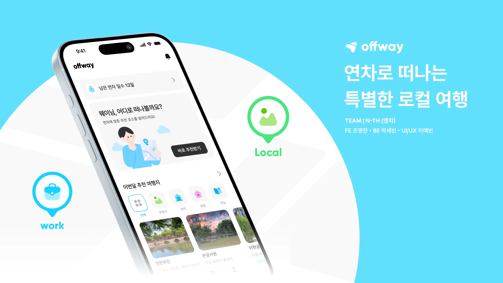

[](https://apps.apple.com/app/id6793610290)

국내 여행 수요가 주요 도시로 쏠리는 동안, 행정안전부가 지정한 **89개 인구감소지역**은 생활인구 유입이 절실합니다.

정부와 지자체가 숙박세일페스타, 디지털관광주민증, KTX·SRT 할인 같은 지원책을 마련했지만, 정보가 부처와 지자체마다 흩어져 있어 여행자에게 잘 닿지 않습니다.

Offway 는 **남은 연차**에 맞춰 89개 지역의 여행 코스를 완성하고, 그 여정에서 받을 수 있는 교통·숙박 혜택을 함께 연결합니다.

이 레포는 Offway **iOS 앱**(Flutter)입니다. 서버는 [team-offway/core](https://github.com/team-offway/core)에서 제공합니다.

## 목차

1. [서비스 소개](#서비스-소개)
2. [주요 화면](#주요-화면)
3. [앱에서 신경 쓴 것](#앱에서-신경-쓴-것)
4. [기술 스택](#기술-스택)
5. [앱 구조](#앱-구조)
6. [팀 소개](#팀-소개)
7. [개발 환경](#개발-환경)

## 서비스 소개

**여행지를 고르는 기준을 바꿨습니다.**

대부분의 여행 서비스가 '어디로 갈지'를 먼저 정한다면, Offway 는 '이번 여행에 연차를 얼마나 쓸 수 있는지'부터 봅니다. 남은 연차와 출발지, 이동수단, 여행 스타일에 맞춰 실제로 다녀올 수 있는 지역과 코스를 추천합니다.

**여행 전후의 연차까지 함께 관리합니다.**

남은 연차를 기록하고 황금연휴처럼 연차를 쓰기 좋은 시기를 알려줍니다. 여행을 다녀오면 사용한 연차를 반영해 다음 여행 계획에 다시 씁니다.

**89개 인구감소지역을 중심으로 소개합니다.**

익숙한 인기 관광지보다 인구감소지역 89곳을 중심으로 새로운 여행지를 제안합니다. 모든 코스는 **최대 2박 3일**입니다 — 콘텐츠가 얇은 지역에서 그보다 길어지면 코스가 빈약해지기 때문입니다.

## 주요 화면

**1 · 연차 기반 맞춤 여행 코스 추천**

| 연차 입력 | 홈 | 기간 스타일 | 이동수단 |
|:---:|:---:|:---:|:---:|
| 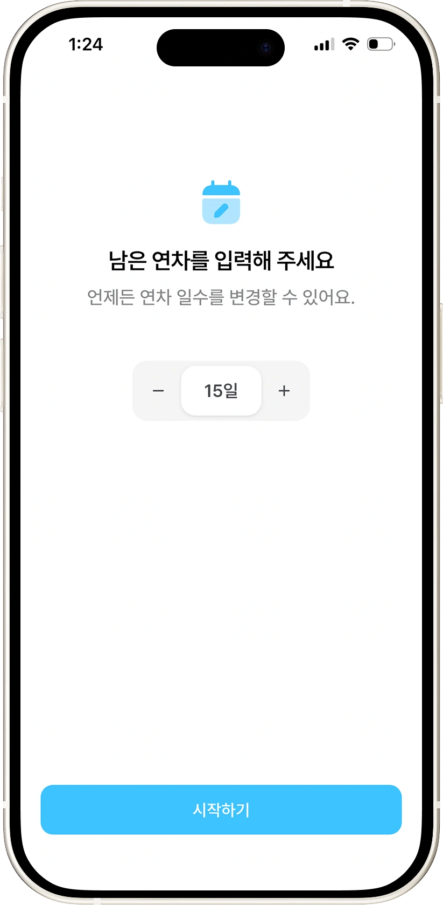 | 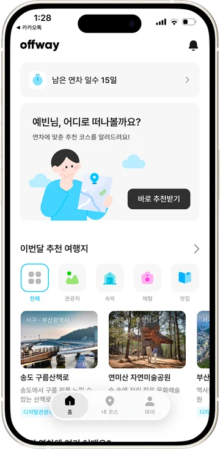 | 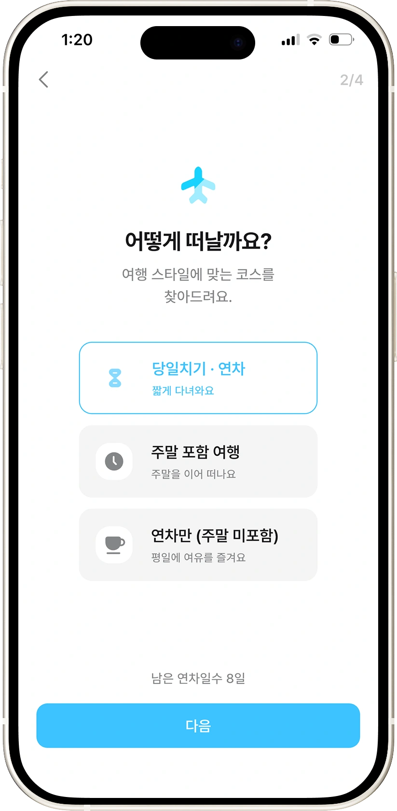 | 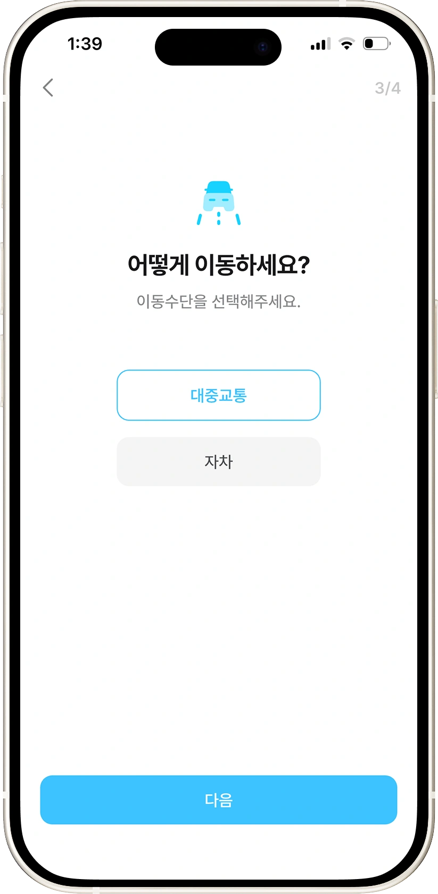 |

**2 · 조건에 맞는 지역·코스 추천**

| 추천 계산 | 후보 지역 | 코스 추천 | 혜택 확인·저장 |
|:---:|:---:|:---:|:---:|
|  | 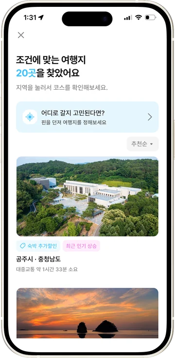 | 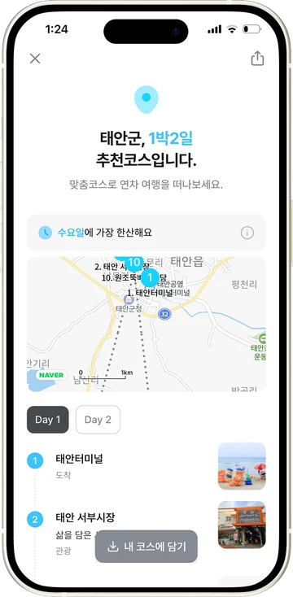 | 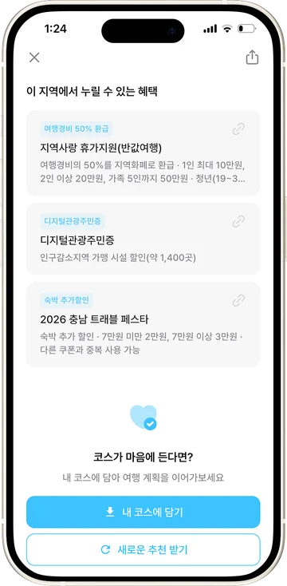 |

**3 · 저장한 여행 관리·상세 정보**

| 내 코스 | 코스 상세 | 운영 정보 | 장소 상세 |
|:---:|:---:|:---:|:---:|
| 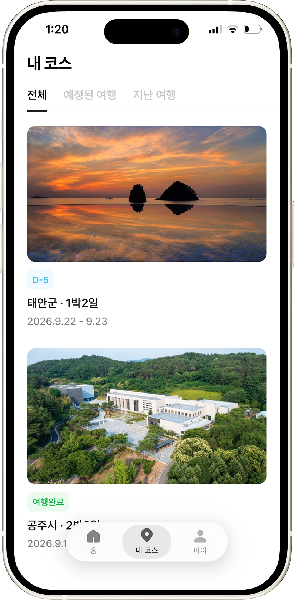 | 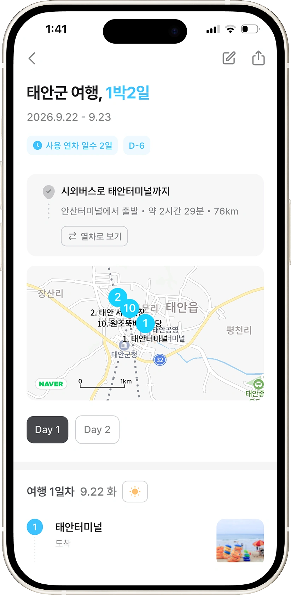 | 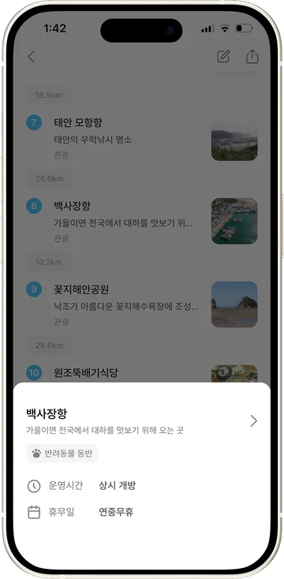 | 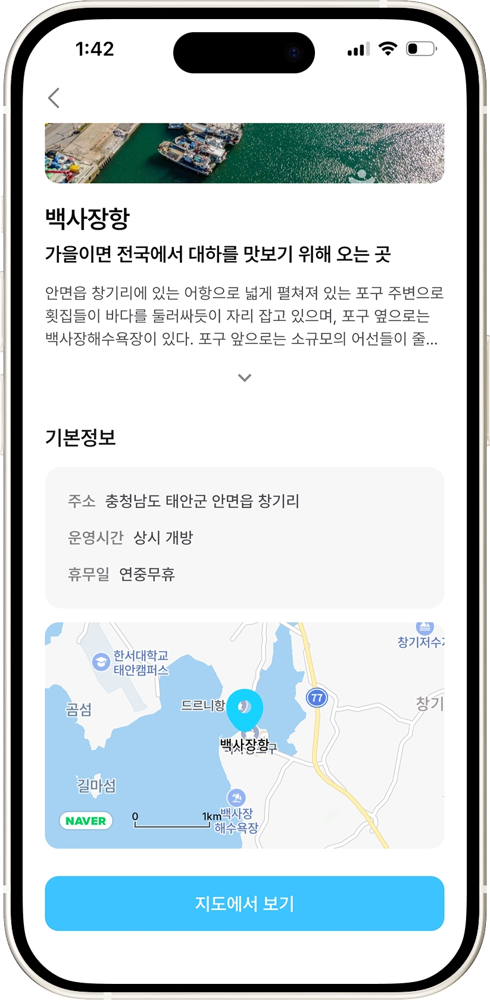 |

**4 · 연차 사용 기록 및 관리**

| 여행 후 확인 | 내 연차 | 연차 사용 등록 | 연차 반영 |
|:---:|:---:|:---:|:---:|
| 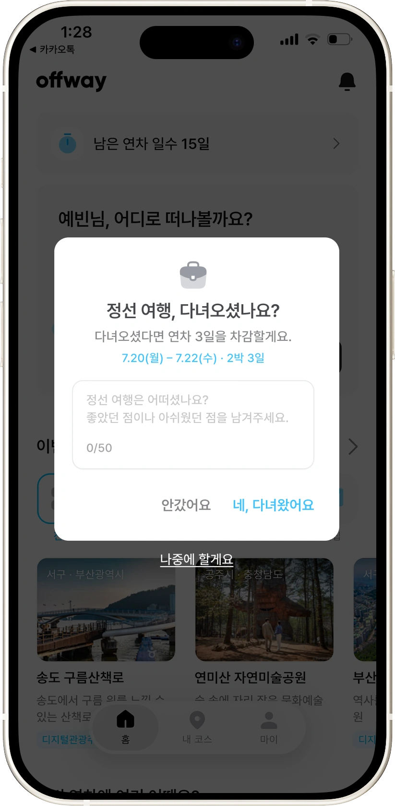 | 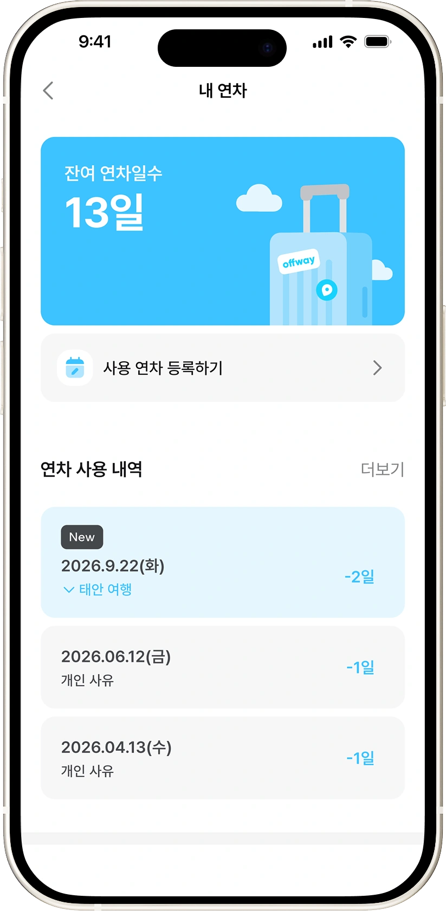 | 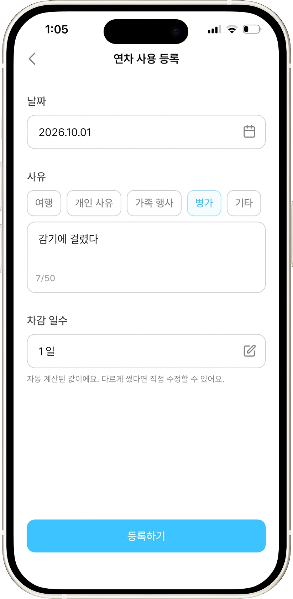 | 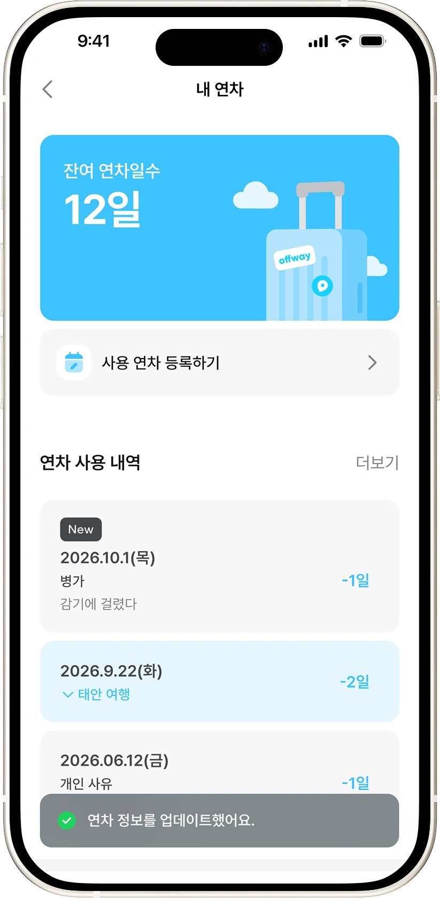 |

**5 · 여행 정보 탐색 및 일정 알림**

| 여행 혜택 | 지역 상세 | 관광지·혜택 | 위젯·다이나믹 아일랜드 |
|:---:|:---:|:---:|:---:|
| 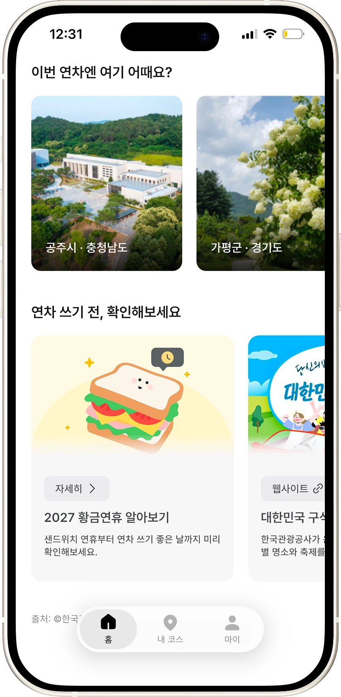 | 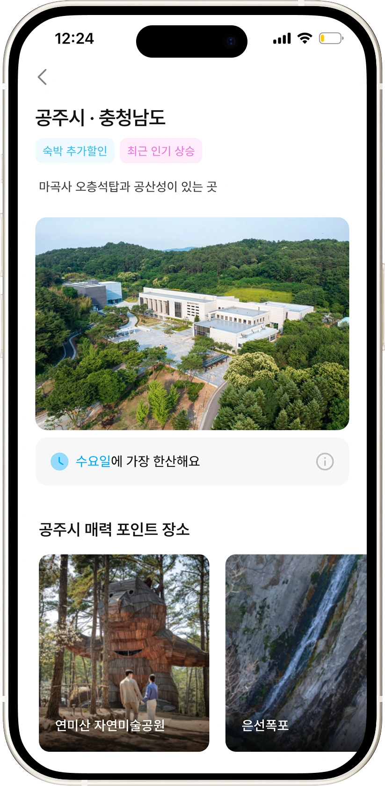 | 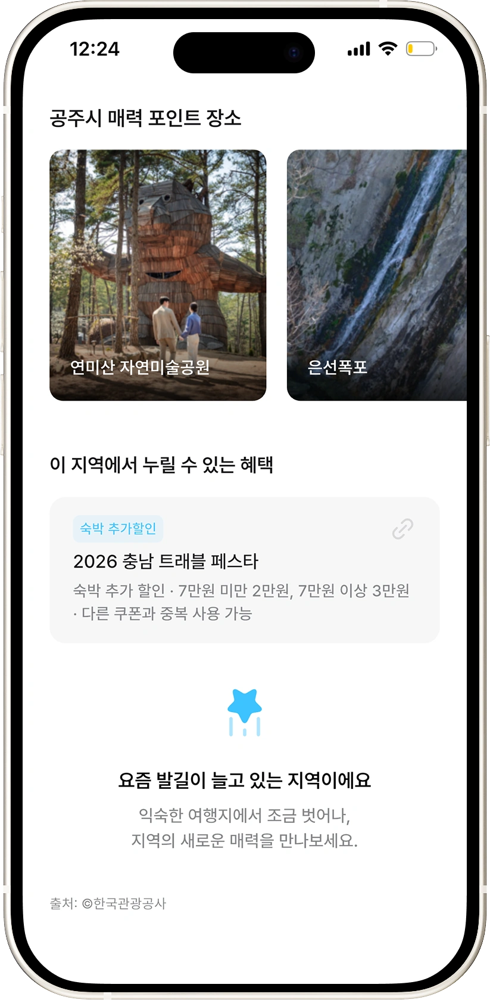 | 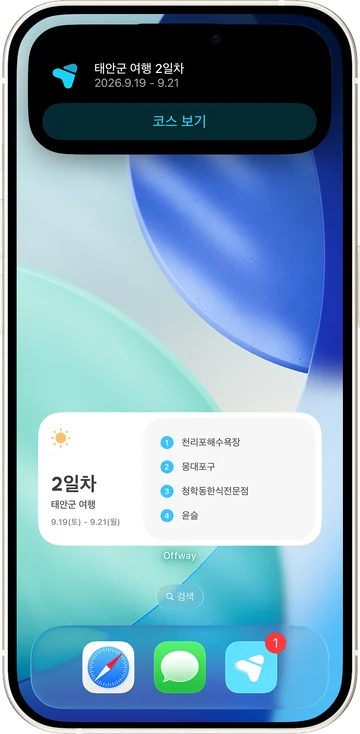 |

## 앱에서 신경 쓴 것

**앱을 열지 않아도 여행이 보입니다.**
홈 화면 위젯(소형·중형), 잠금화면 위젯 세 자리, 다이나믹 아일랜드에 여행까지 남은 날과 여행 중 며칠째인지가 뜹니다. 날짜가 바뀌면 앱을 켜지 않아도 알아서 넘어가고, 출발이 다가오면 서버가 잠금화면 카드를 직접 띄웁니다.

**앱이 없는 사람에게도 코스를 보여줍니다.**
코스를 카카오톡 카드·링크·이미지로 공유할 수 있습니다. 링크를 받은 사람은 앱 없이 브라우저([offway.cloud](https://offway.cloud))에서 코스를 봅니다.

**때맞춰 알려줍니다.**
여행 전날에는 내일 떠날 여행을, 여행이 끝나면 연차 차감을 확인하라고 알립니다. 알림을 누르면 그 여행으로 바로 갑니다.

**로그인은 가볍게.**
카카오·Apple·구글 계정으로 바로 시작합니다.

## 기술 스택

**Framework & Language**

<p>
  
  
  
</p>

**State · Routing · Network**

<p>
  
  
  
</p>

**iOS Native**

<p>
  
  
  
</p>

**SDK & 연동**

<p>
  
  
  
  
  
</p>

**Web · CI**

<p>
  
  
</p>

## 앱 구조

기능(도메인) 단위로 나눕니다. 각 기능은 `data`(API·repository) / `domain`(모델) / `presentation`(화면·상태) 세 층입니다. 모델은 코드 생성 없이 `Map<String, dynamic>` 기반입니다.

```text
lib/
├── main.dart                  # 엔트리포인트 (SDK 초기화 + ProviderScope)
├── app/app.dart               # 루트 위젯 (MaterialApp.router)
├── core/                      # 앱 전역 공통 모듈
│   ├── config/app_config.dart     # API base URL·공개 키 (--dart-define 주입)
│   ├── network/dio_client.dart    # Dio 프로바이더 + Auth 인터셉터
│   ├── router/app_router.dart     # GoRouter 라우트 정의
│   ├── storage/secure_storage.dart# JWT 토큰 Keychain 저장소
│   ├── theme/                     # Material 3 테마 + 디자인 토큰(tokens/)
│   └── utils/bottom_inset.dart    # 홈 인디케이터 높이 — SafeArea 하단 규칙
├── mock/                      # 테스트 픽스처 로더 (앱 코드에서는 쓰지 않음)
└── features/                  # 기능(도메인) 단위 모듈
    ├── splash/                    # 스플래시 · 첫 화면 판정
    ├── auth/                      # 로그인 (카카오·Apple·구글)
    ├── onboarding/                # 잔여연차 입력
    ├── home/                      # 홈
    ├── region/                    # 지역 상세
    ├── course_wizard/             # 코스 추천 위저드
    ├── course/                    # 코스 확정·내 코스·공유
    ├── leave/                     # 내 연차·사용 내역
    ├── notification/              # 알림
    ├── trip_activity/             # 잠금화면·다이나믹 아일랜드 여행 D-day
    ├── update/                    # 앱 업데이트 안내
    ├── policy/                    # 약관·방침
    └── my/                        # 마이

ios/TripActivity/              # Live Activity 확장 (Swift) — 카드 그리기·문구 조립
docs/                          # 백엔드 요청서 · Live Activity 설정 기록
```

잠금화면·위젯은 Swift 확장(`ios/TripActivity/`)이 그립니다. Flutter 는 재료(지역·날짜)만 넘기고, **'D-3'·'내일 …'·'2일차' 같은 문구는 네이티브 한 곳**에서 만듭니다.

## 팀 소개

<table>
  <thead>
    <tr>
      <th align="center" width="33%">Client</th>
      <th align="center" width="33%">Backend</th>
      <th align="center" width="33%">Design</th>
    </tr>
  </thead>
  <tbody>
    <tr>
      <td align="center"></td>
      <td align="center"></td>
      <td align="center"></td>
    </tr>
    <tr>
      <td align="center"><b>조영찬</b></td>
      <td align="center"><b>박세빈</b></td>
      <td align="center"><b>이예빈</b></td>
    </tr>
    <tr>
      <td align="center"><a href="https://github.com/ychany">@ychany</a></td>
      <td align="center"><a href="https://github.com/sevineleven">@sevineleven</a></td>
      <td align="center"><a href="https://www.behance.net/bad7ac99">Behance</a></td>
    </tr>
  </tbody>
</table>

## 개발 환경

<details>
<summary>실행 · 테스트 · 배포 · 주의사항</summary>

### 실행

```bash
flutter run                                          # iOS 시뮬레이터 실행

# 배포 서버 접속 (권장)
flutter run --dart-define-from-file=env.json

# 주소만 따로 지정할 때 (로컬 백엔드 등)
flutter run --dart-define=API_BASE_URL=http://localhost:8080

# 특정 화면부터 시작 (개발용)
flutter run --dart-define=INITIAL_ROUTE=/wizard/calendar
```

실기기에 **설치해서 단독으로 켤** 때는 `flutter build ios --profile` 로 빌드합니다. `--debug` 는 Dart 코드를 Mac 의 Flutter 툴에서 받아오므로 `flutter run` 이나 Xcode 없이 홈 화면에서 열면 곧바로 죽습니다.

`env.json`은 `env.json.example`을 복사해 만듭니다. 배포 서버가 임시 Basic 게이트 뒤에 있어 계정 없이 부르면 전부 401이 납니다. **gitignore 대상이라 커밋하지 않습니다.**

### 웹 (offway.cloud)

공유 링크를 받은 사람이 **앱 없이 브라우저에서** 코스를 보는 페이지와, 심사에 필요한 법적 문서를 함께 배포합니다. Vercel 프로젝트의 Root Directory는 `web/share`입니다.

| 주소 | 내용 |
|---|---|
| `/` | 서비스 소개 랜딩 |
| `/r/{token}` | 추천코스 공유 — 담기 전 코스를 공유한 링크 |
| `/m/{token}` | 내 코스 공유 — 담아둔 코스 (여행 날짜·사용 연차·D-DAY) |
| `/privacy` · `/terms` | 개인정보처리방침 · 이용약관 (한국어·영문) |

백엔드(`https://api.offway.cloud`)가 브라우저 직접 호출에 CORS를 열어 주지 않으므로, `web/share/api/*.js`가 같은 출처에서 받아 대신 부릅니다.

### 테스트 / 린트

```bash
flutter test        # 위젯·단위 테스트
flutter analyze
dart format .

# 네이티브(Swift) — 잠금화면 문구 규칙 · 서버 content-state 계약
# (먼저 flutter build ios --simulator 로 Flutter 프레임워크를 만들어 둔다)
cd ios && xcodebuild test -workspace Runner.xcworkspace -scheme Runner \
  -destination 'platform=iOS Simulator,name=iPhone 17 Pro' -only-testing:RunnerTests
```

PR마다 GitHub Actions가 포맷·분석·테스트를 검사하며, 통과해야 머지할 수 있습니다. `main` 직접 푸시는 브랜치 보호로 차단되어 있습니다.

### 비고

- 번들 ID: `com.nth.offway` · App Store 등록명: **[Offway - 연차로 떠나는 로컬 여행](https://apps.apple.com/app/id6793610290)**
- iOS 최소 버전은 **15.0**, Live Activity 확장만 **16.1** 입니다. 15.x 기기는 앱은 정상이고 잠금화면 카드만 없습니다 — 그 기기들은 다이나믹 아일랜드 하드웨어가 없어 앱 버전을 올려도 얻는 것이 없습니다. 확장 설정과 겪은 함정은 `docs/live-activity-setup.md`
- Xcode 작업 시 `ios/Runner.xcworkspace`를 엽니다 (`.xcodeproj` 아님)
- 카카오 앱 키를 바꿀 때는 `ios/Flutter/AppKeys.xcconfig`(URL scheme)와 `AppConfig`(SDK 초기화) **두 곳을 함께** 수정해야 합니다. 한쪽만 바꾸면 카카오톡에서 앱으로 복귀하지 못합니다
- 레포가 **public**이므로 시크릿은 어떤 형태로도 커밋하지 않습니다 (카카오 REST API 키·Admin 키·클라이언트 시크릿, Apple `.p8`·APNs 키, 네이버 지도 Client Secret 등 — 서버가 쓰는 값은 백엔드 환경변수로만 관리)
- 예외적으로 **제공자가 공개 식별자로 명시했고 콘솔에서 번들 ID(`com.nth.offway`) 제한이 걸린 값**만 포함되어 있습니다: 네이버 지도 Client ID, 카카오 네이티브 앱 키, 구글 `REVERSED_CLIENT_ID`. 그 외 값은 `--dart-define`으로 주입합니다

### 출시

App Store 정식 출시 2026-08-27 (v1.0.0). 사전 배포와 검증은 TestFlight 로 합니다.

</details>
